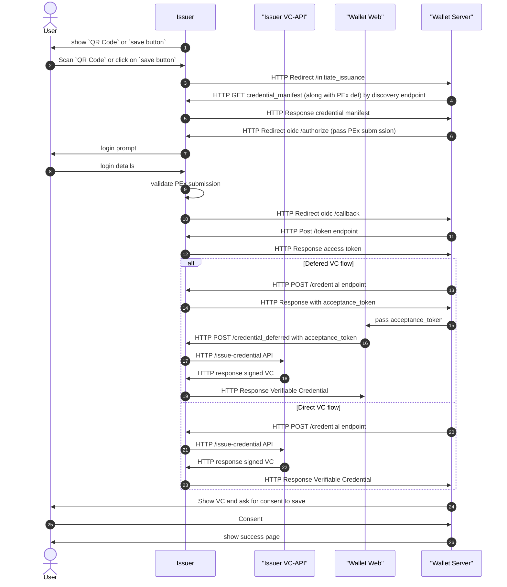

# TrustBlooc OpenID Connect for Verifiable Credential Issuance 

This is a WIP document of Draft [OpenID Connect for Verifiable Credential Issuance](https://openid.net/specs/openid-connect-4-verifiable-credential-issuance-1_0.html) 
implementation in TrustBloc platform.

## Sequence diagram

