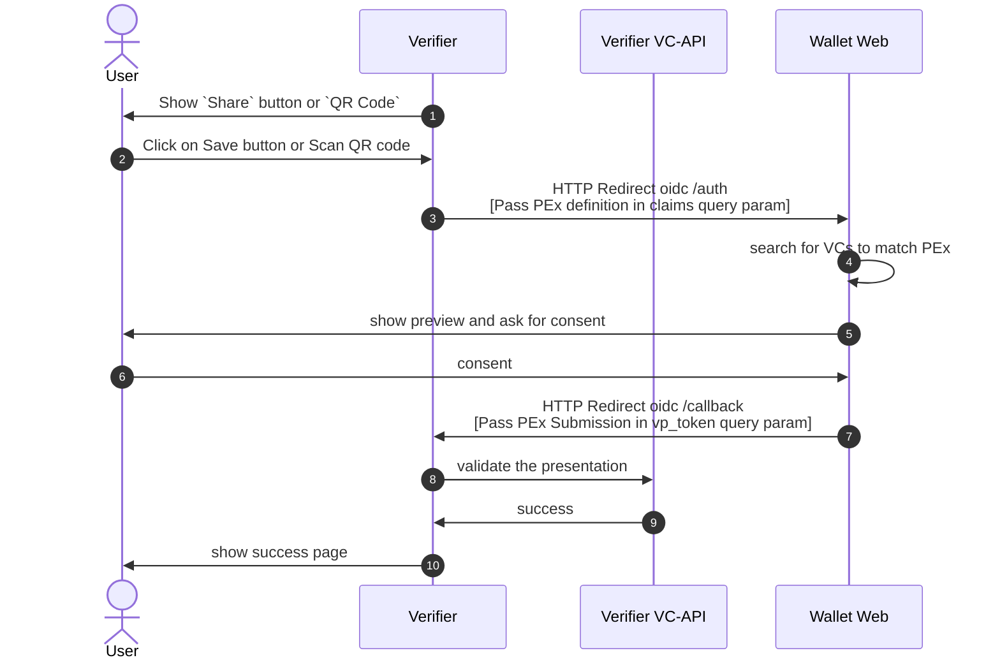

# TrustBlooc OpenID Connect for Verifiable Presentations

This is a WIP document of Draft [OpenID Connect for Verifiable Presentations](https://openid.net/specs/openid-connect-4-verifiable-presentations-1_0.html) 
implementation in TrustBloc platform.

## Sequence diagram
