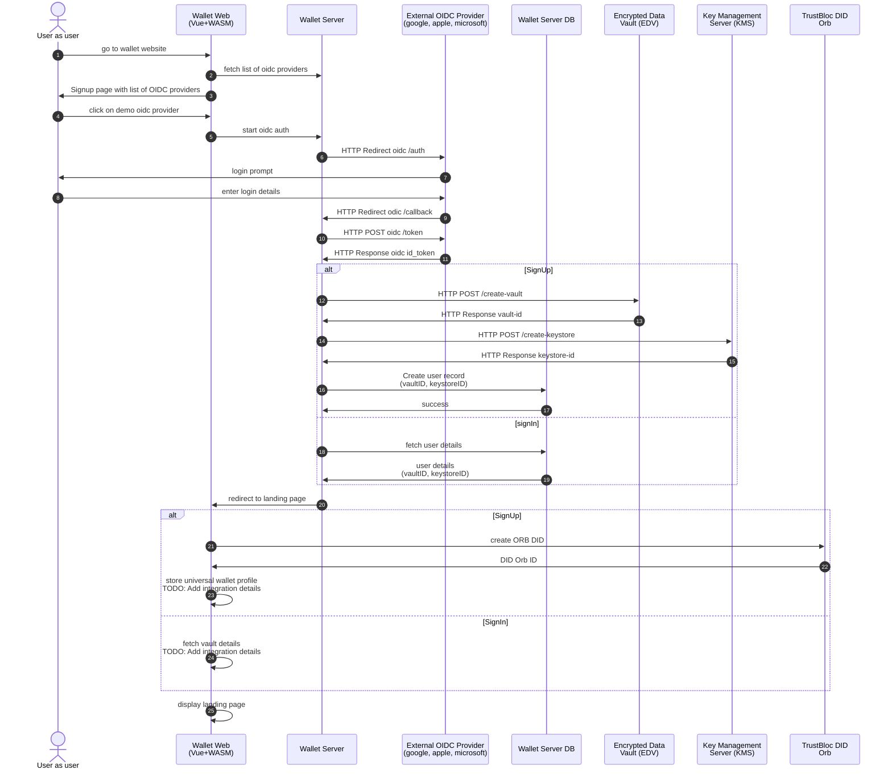

# Wallet 

This is a WIP document of TrustBloc Wallet Interactions

## SignUp/SignIn

```mermaid
sequenceDiagram
    autonumber
    actor user as User as user
    participant wallet_web as Wallet Web <br/>(Vue+WASM)
    participant wallet_server as Wallet Server 
    participant ext_oidc as External OIDC Provider <br/>(google, apple, microsoft)
    participant db as Wallet Server DB
    participant edv as Encrypted Data <br/>Vault (EDV)
    participant kms as Key Management <br/>Server (KMS)
    participant orb as TrustBloc DID <br/>Orb
    
    user ->> wallet_web : go to wallet website
    wallet_web ->> wallet_server : fetch list of oidc providers
    wallet_web ->> user : Signup page with list of OIDC providers
    user ->> wallet_web : click on demo oidc provider
    wallet_web ->> wallet_server : start oidc auth
    wallet_server ->> ext_oidc : HTTP Redirect oidc /auth
    ext_oidc ->> user : login prompt
    user ->> ext_oidc : enter login details
    ext_oidc ->> wallet_server : HTTP Redirect odic /callback
    wallet_server ->> ext_oidc : HTTP POST oidc /token
    ext_oidc ->> wallet_server : HTTP Response oidc id_token
    
    alt SignUp
    wallet_server ->> edv : HTTP POST /create-vault
    edv ->> wallet_server : HTTP Response vault-id
    wallet_server ->> kms : HTTP POST /create-keystore
    kms ->> wallet_server : HTTP Response keystore-id
    wallet_server ->> db : Create user record <br/>(vaultID, keystoreID)
    db ->> wallet_server : success
    else signIn
    wallet_server ->> db : fetch user details
    db ->> wallet_server : user details <br/>(vaultID, keystoreID)
    end
    
    wallet_server ->> wallet_web : redirect to landing page
    
    alt SignUp
    wallet_web ->> orb : create ORB DID
    orb ->> wallet_web : DID Orb ID
    wallet_web ->> wallet_web : store universal wallet profile <br/>TODO: Add integration details
    else SignIn
    wallet_web ->> wallet_web : fetch vault details <br/>TODO: Add integration details
    end
    
    wallet_web ->> wallet_web : display landing page
```